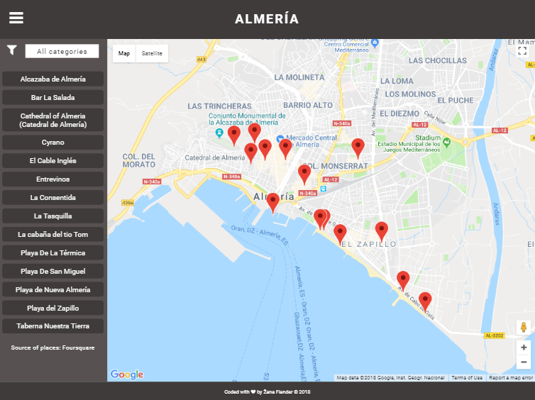

# Neighborhood map of city Almería

## Table of contents
* [Introduction](#introduction)
* [Installation](#installation)
* [Note](#note)
* [How I built the project](#how-i-built-the-project)
* [Sources](#sources)

## Introduction
Project Neighborhood map is the final project of nanodegree Front-End Web Developer at Udacity. For this project, we used all that we have learned during the past 6 months. My project is displaying places of the city Almería in Spain.

## Installation
- Clone `https://github.com/flanzana/almeria-map.git`.
- `cd` to the project folder and run `npm start`.
- Open `http://localhost:3000/`(http://localhost:3000/) in your browser (Google Chrome is recommended).

## Note
While I was working on my project, Google changed the requirements for using Google Maps API key: when exceeding request quota for API, it is obligatory to provide billing info, otherwise every tile of Google Maps will text layer `For development purposes only`. Please, do not be bothered by that text. :)

## How I built the project
- I built the project from scratch with [`create-react-app`](https://github.com/facebookincubator/create-react-app).
- I used [Foursquare API](https://developer.foursquare.com/) as a third-party APIs to fetch the data of the places from the list [Almeria](https://foursquare.com/user/507697890/list/almeria). The data I used further in my project were name, location (coordinates), category and address. If an error occurs while loading data, alert message will appear in the browser.
- For displaying a map, I used a package [`react-google-maps`](https://www.npmjs.com/package/react-google-maps) which import Google Maps API and all the features such as `withGoogleMap`, `withScriptjs`, `GoogleMap`, `Marker` and `InfoWindow`. To load a map, I needed to provide two items: loadingElement used by `withScriptjs` to get rendered while it's async-loading the google scripts and URL used by `withGoogleMap` to download the script from, including our API key.
- Dropdown menu will filter all places based on categories which is defined in Foursquare. By selecting a category, list view and markers will update accordingly in real time.
- When clicking on a marker or a list item, the info window will display unique information about the selected place.
- The project is accessible: tabIndex, ARIA roles and labels.
- The project is responsive for all devices: computer, tablet and mobile devices.
- Project handles error of third-party APIs (Google Maps API and Foursquare API).
- Service worker does not work in `localhost` mode. It will work only in production mode because of required HTTPS.

#### My components:
- `Map.js`: Contains map container with Google Maps API and markers.
- `Menu.js`: Contains filter by categories and list view of places.
- `PlaceItem.js`: List view of places.
- `InfoWinContent.js`: Content of info window of selected place.

#### Packages used in the project:
- [`react-google-maps`](https://www.npmjs.com/package/react-google-maps): Import Google Maps API and all the features such as `withGoogleMap`, `withScriptjs`, `GoogleMap`, `Marker` and `InfoWindow`.
- [`react-accessible-dropdown`](https://www.npmjs.com/package/react-accessible-dropdown): Dropdown menu displays categories of places. Accessibility is implemented by default in the package.
- [`sort-by`](https://www.npmjs.com/package/sort-by): Sort names by alphabetical order.

## Sources
- [Foursquare API docs](https://developer.foursquare.com/docs)
- [Google Maps API docs](https://developers.google.com/maps/documentation/)
- [`react-google-maps` docs](https://tomchentw.github.io/react-google-maps/)
- [How to solve issue with loading a map with `react-google-maps`](https://github.com/tomchentw/react-google-maps/issues/414)
- [How to fetch API](https://developer.mozilla.org/en-US/docs/Web/API/Fetch_API/Using_Fetch)
- [How to add animation to marker in `react-google-maps`](https://stackoverflow.com/questions/44729776/how-can-animation-be-added-to-markers-in-react-google-maps)
- [Display infoWindow of only selected marker](https://gist.github.com/jwo/43b382fc60eb09d3a415c9953f4057f8)
- [Accessible dropdown menu](https://www.npmjs.com/package/react-accessible-dropdown)
- [Listening for authentication errors from Google Maps API](https://developers.google.com/maps/documentation/javascript/events)